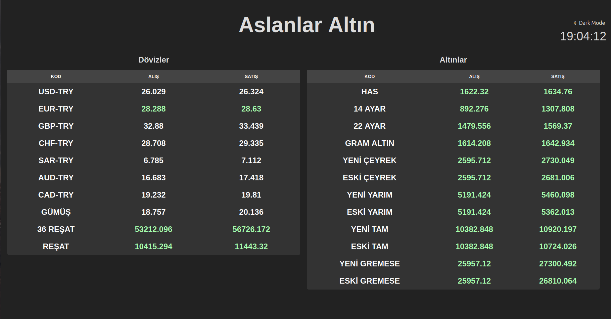

# aslanlaraltin.com

You are viewing the Python application I designed to fulfill my client's request. The purpose of this application is to fetch exchange rate data from the `https://www.haremaltin.com/` address, add a profit margin, and publish it on a website.

Making requests to `https://www.haremaltin.com/dashboard/ajax/doviz`, and then appending the profit amounts from the `kar_listesi.json` file to the incoming price data. Continuously updating the data table and present it to users on `aslanlaraltin.com` using `Flask` & `Jinja2`.

Visit [Aslanlar Altın](https://aslanlaraltin.com) to see the live website.

